# KitchenwarePackagingCompliance

A Java OCR system that reads product labels on kitchenware packaging (Prestige / Judge brand pressure cookers and cookware) and validates that the **product name**, **retail price**, and **manufacturing date** printed on the label match a known Price Master reference file.

The system watches an input folder for incoming label images, processes each image through a multi-threaded pipeline, and writes structured validation results to an output folder. A JavaFX UI displays live results and exposes Start / Stop / Report controls.

---

## Table of Contents

- [Architecture Overview](#architecture-overview)
- [Package Structure](#package-structure)
- [Class Diagram](#class-diagram)
- [Inheritance Hierarchy](#inheritance-hierarchy)
- [Component Dependencies](#component-dependencies)
- [Main Processing Pipeline](#main-processing-pipeline)
- [Image Processing Detail](#image-processing-detail)
- [Bounding Box Pipeline](#bounding-box-pipeline)
- [Tesseract Pool Lifecycle](#tesseract-pool-lifecycle)
- [Validation Flow](#validation-flow)
- [Threading Model](#threading-model)
- [Per-Image State Machine](#per-image-state-machine)
- [File Watcher Loop](#file-watcher-loop)
- [Initialisation Sequence](#initialisation-sequence)
- [External Dependencies](#external-dependencies)

---

## Architecture Overview

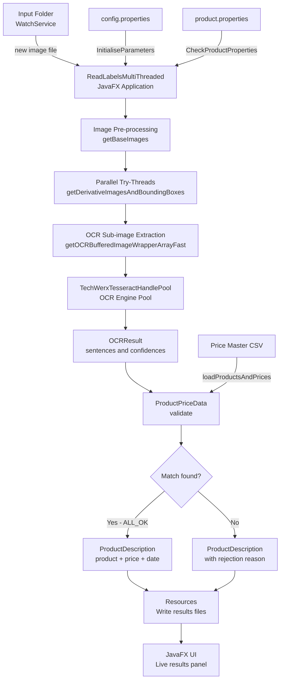

---

## Package Structure

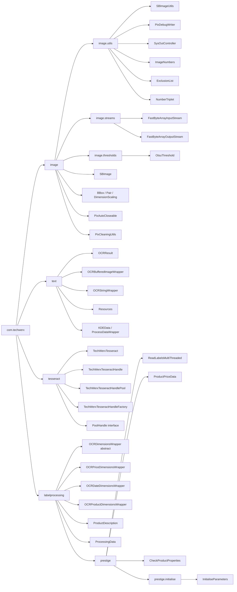

---

## Class Diagram

```mermaid
classDiagram
    direction TB

    class ReadLabelsMultiThreaded {
        +int debugLevel
        +ExecutorService outerThreadService
        +ExecutorService innerThreadService
        +processFileMultiThreadedFast(path) ProductDescription
        +getBaseImages(pix, debugL) void
        +getDerivativeImagesAndBoundingBoxes(debugL) void
        +getBoundingBoxes(pix, threadNum, debugL) ArrayList
        +getOCRBufferedImageWrapperArrayFast(pix, boxes) ArrayList
        +getFinalProductDescriptions(debugL) ProductDescription
    }

    class ProductPriceData {
        +HashMap productPriceMap
        +ArrayList products
        +ArrayList prices
        +ArrayList months
        +ArrayList years
        +loadProductsAndPrices() void
        +validate(ocrResults, debugL) ProductDescription
        +processForMonth(line, h, debugL) Entry
        +processForYear(line, debugL) String
        +processForPrice(line, h, boxes, idx, debugL) ArrayList
        +findProductIndexUsingFuzzyWuzzy(line, cutoff, debugL) List
    }

    class ProductDescription {
        +String fileName
        +String productName
        +ArrayList price
        +String finalPrice
        +String month
        +String year
        +int productOK
        +String rejectionReason
        +int ALL_OK$
        +int ERROR_ONLY_ONE_THING_NOT_FOUND$
        +int ERROR_DIMENSION_PROBLEM$
        +int BAD_ERROR_WILL_NEED_REPROCESSING$
    }

    class InitialiseParameters {
        +initialise() bool
        +initialise(file, fallback) bool
        +getProductSetting(file, fallback) bool
        -loadPropertiesFromFile(f, silent) Properties
        -applySystemProperties(props) String
        -setupLibraryPaths(folder) String
        -loadNativeLibraries(folder, lept, tess, ext) void
    }

    class CheckProductProperties {
        +bool productIsGiven$
        +int givenProductPrice$
        +checkIfProductIsGiven() bool
        +reset() void
    }

    class OCRDimensionsWrapper {
        <<abstract>>
        +int likelyPixelHeight
        +double likelyActualHeight
        +String ocrString
        +ArrayList boundingBoxes
        +bool heightOK
        +String reasonForRejection
        +process(basePixH, baseActualH) void
    }

    class OCRPriceDimensionsWrapper {
        +double gapBetween1And2
        +bool distanceOK
        +String reasonForDistanceRejection
        +process(basePixH, baseActualH) void
    }

    class OCRProductDimensionsWrapper {
        +process(basePixH, baseActualH) void
    }

    class OCRDateDimensionsWrapper {
        +process(basePixH, baseActualH) void
    }

    class TechWerxTesseract {
        +String datapath$
        +String language$
        +doOCR(image) String
        +isValid() bool
        +destroy() bool
    }

    class TechWerxTesseractHandle {
        -TechWerxTesseract handle
        -int processInstance
        +isValid() bool
        +release() bool
        +destroy() bool
        +getHandle() TechWerxTesseract
    }

    class TechWerxTesseractHandlePool {
        +GenericObjectPoolConfig singletonConfig$
        +GenericObjectPoolConfig defaultConfig$
        +GenericObjectPoolConfig smallPoolConfig$
        +int processInstance
    }

    class TechWerxTesseractHandleFactory {
        +bool strictChecking$
        +create() TechWerxTesseractHandle
        +validateObject(po) bool
        +destroyObject(po) void
    }

    class PoolHandle {
        <<interface>>
        +handle(object) Object
        +isValid() bool
        +release() bool
        +destroy() bool
    }

    class OCRResult {
        +ArrayList sentences
        +ArrayList confidences
        +add(words, confidence) void
    }

    class OCRStringWrapper {
        +int likelyPixelHeight
        +String ocrString
        +ArrayList boundingBoxes
    }

    class OCRBufferedImageWrapper {
        +int likelyPixelHeight
        +BufferedImage image
        +ArrayList boundingBoxes
    }

    class PixCleaningUtils {
        +removeSaltPepper(pix, debugL, dir) Pix$
        +removeLines(pix, debugL, dir, tryNo) Pix$
    }

    class PixDebugWriter {
        +writeIfDebug(debugL, threshold, pix, path) void$
    }

    class PixAutoCloseable {
        -Pix pix
        +get() Pix
        +close() void
    }

    class Resources {
        +writeRollingResult(text) void
        +writeResult(product) void
        +writeError(product) void
    }

    class ProcessDataWrapper {
        +bool linesNeededSplitting
        +KDEData kdeData
        +reset() void
    }

    OCRDimensionsWrapper <|-- OCRPriceDimensionsWrapper
    OCRDimensionsWrapper <|-- OCRProductDimensionsWrapper
    OCRDimensionsWrapper <|-- OCRDateDimensionsWrapper
    PoolHandle <|.. TechWerxTesseractHandle
    TechWerxTesseractHandlePool --|> GenericObjectPool
    TechWerxTesseractHandleFactory --|> BasePooledObjectFactory
    TechWerxTesseractHandle --> TechWerxTesseract
    TechWerxTesseractHandlePool --> TechWerxTesseractHandleFactory
    ReadLabelsMultiThreaded --> ProductPriceData
    ReadLabelsMultiThreaded --> TechWerxTesseractHandlePool
    ReadLabelsMultiThreaded --> ProductDescription
    ReadLabelsMultiThreaded --> PixCleaningUtils
    ReadLabelsMultiThreaded --> PixDebugWriter
    ReadLabelsMultiThreaded --> OCRBufferedImageWrapper
    ReadLabelsMultiThreaded --> OCRStringWrapper
    ReadLabelsMultiThreaded --> ProcessDataWrapper
    ReadLabelsMultiThreaded --> Resources
    ProductPriceData --> OCRResult
    ProductPriceData --> OCRPriceDimensionsWrapper
    ProductPriceData --> OCRProductDimensionsWrapper
    ProductPriceData --> OCRDateDimensionsWrapper
    ProductPriceData --> ProductDescription
    ProductPriceData --> CheckProductProperties
    InitialiseParameters --> CheckProductProperties
    InitialiseParameters --> ProductPriceData
```

---

## Inheritance Hierarchy

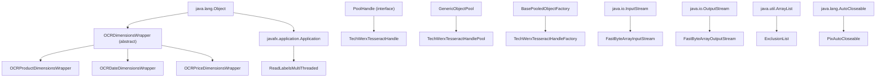

---

## Component Dependencies

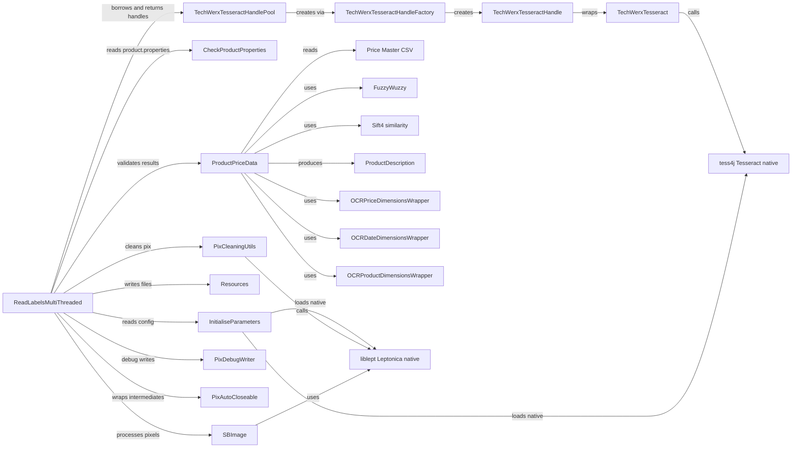

---

## Main Processing Pipeline

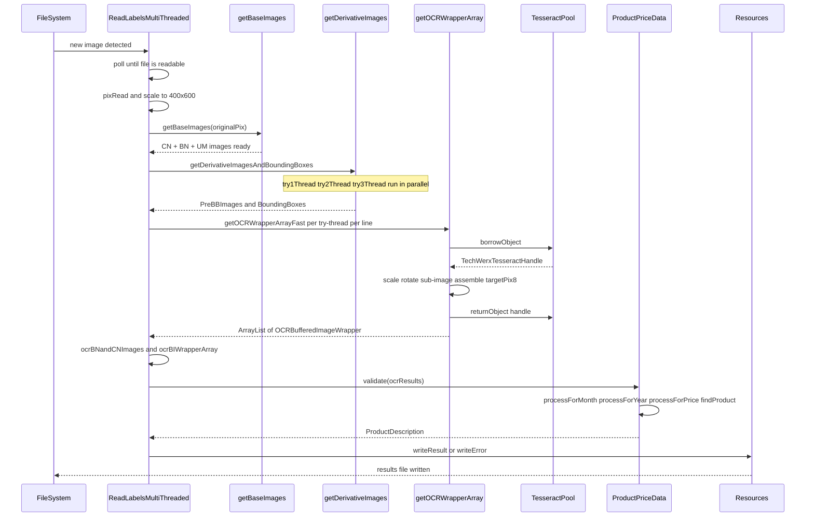

---

## Image Processing Detail

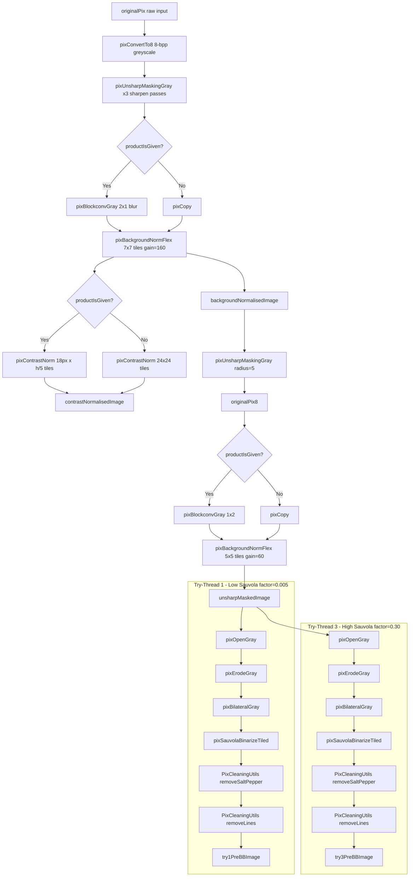

---

## Bounding Box Pipeline

```mermaid
flowchart LR
    IN["tryNPreBBImage 1-bpp cleaned Pix"]
    IN --> R1["Round 1\ngetDefaultBoxes\nsegregateBoxesIntoLines\nremoveSmallBoxes"]
    R1 --> R2["Round 2\nreallocateLines\nhorizontal alignment pass 1"]
    R2 --> R3["Round 3\nreallocateLines\nhorizontal alignment pass 2"]
    R3 --> R4["Round 4\nremoveLargeBoxesAndRedistribute"]
    R4 --> R5["Round 5\nreallocateLines\nhorizontal alignment pass 3"]
    R5 --> R6["Round 6\nreallocateLinesAgain\nfine-grained reallocation"]
    R6 --> R7["Round 7\nsplitLinesByYCoordinate"]
    R7 --> R8["Round 8\nreallocateVerticalBoxes"]
    R8 --> R9["Round 9\nremoveEdgeKissingBoundingBoxes"]
    R9 --> OUT["final bounding boxes per line"]

    style R1 fill:#d4e6f1
    style R2 fill:#d4e6f1
    style R3 fill:#d4e6f1
    style R4 fill:#f9e4b7
    style R5 fill:#d4e6f1
    style R6 fill:#d5f5e3
    style R7 fill:#f5e6d4
    style R8 fill:#f5e6d4
    style R9 fill:#fadbd8
```

---

## Tesseract Pool Lifecycle

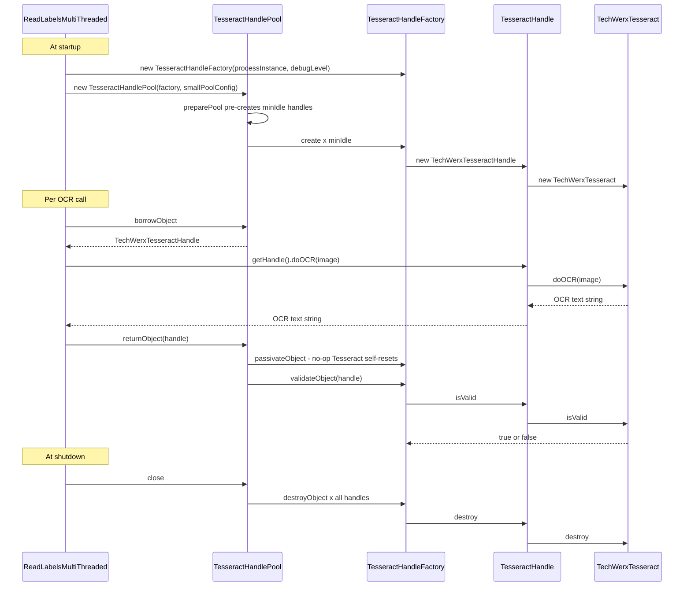

---

## Validation Flow

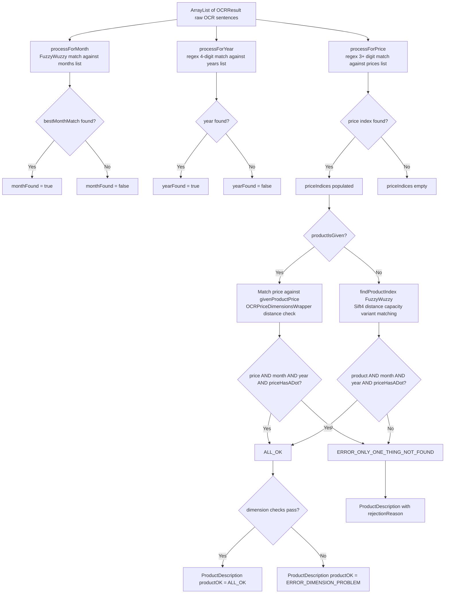

---

## Threading Model

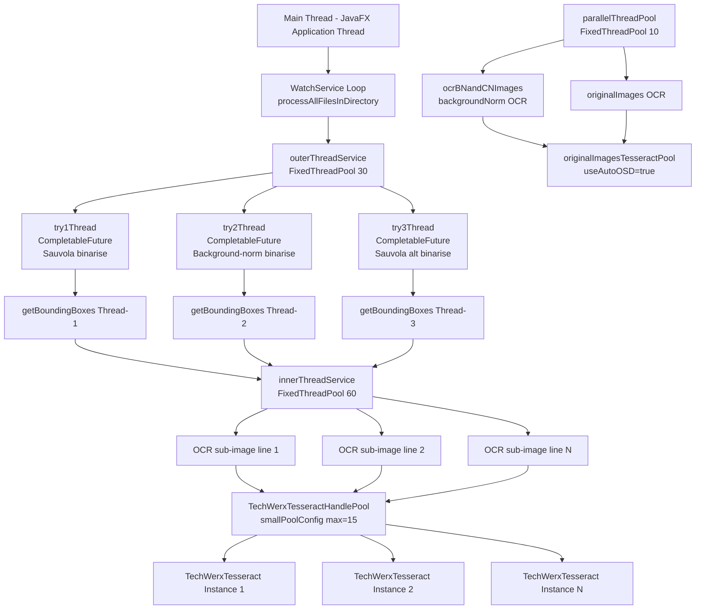

---

## Per-Image State Machine

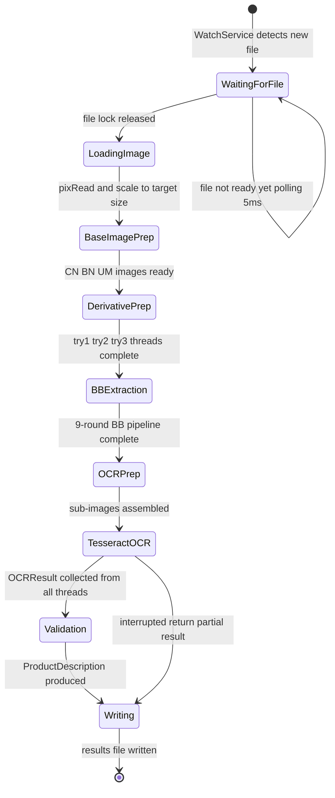

---

## File Watcher Loop

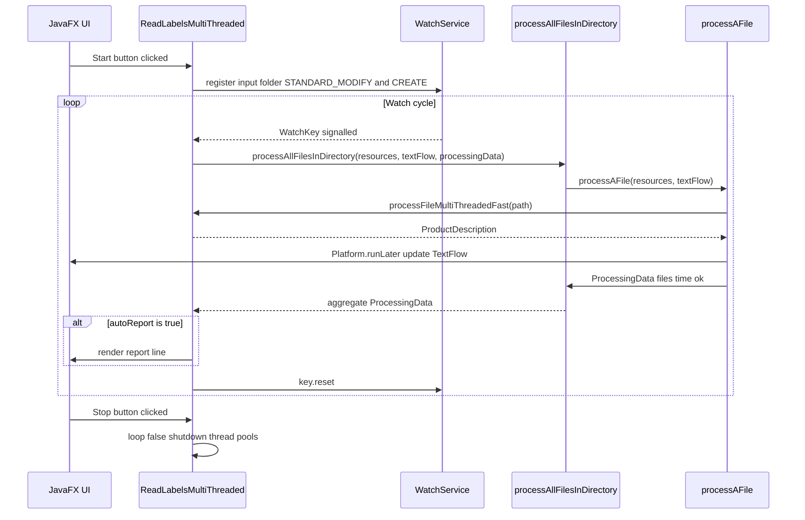

---

## Initialisation Sequence

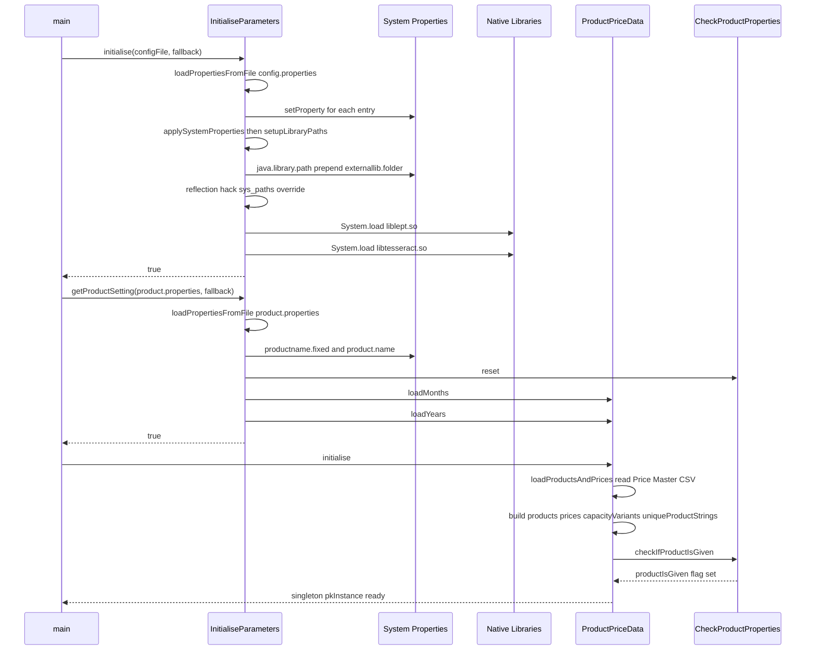

---

## External Dependencies

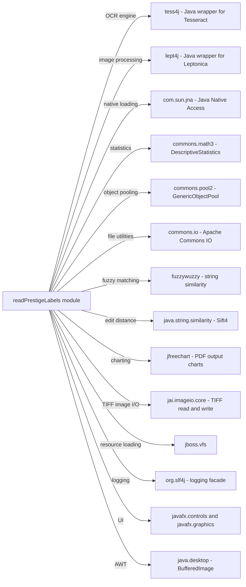